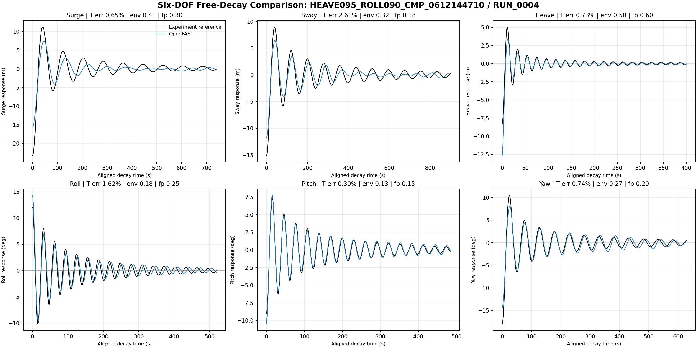
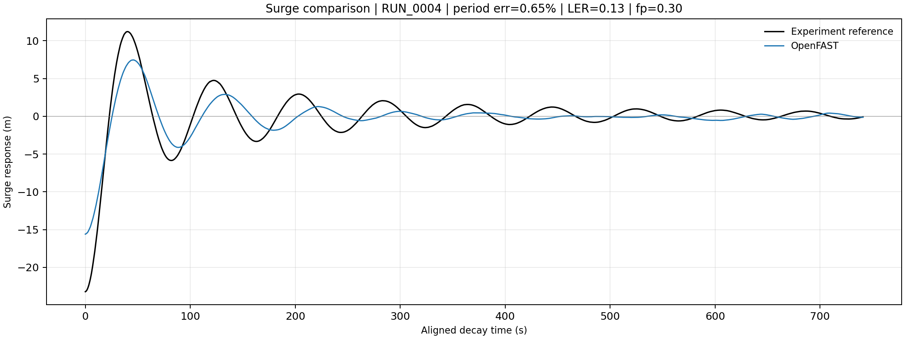
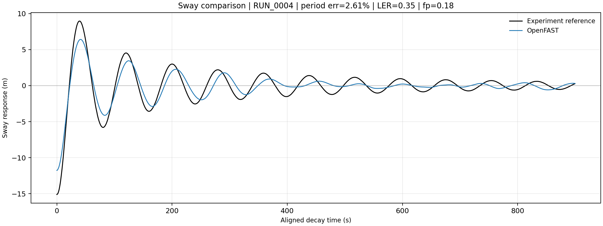
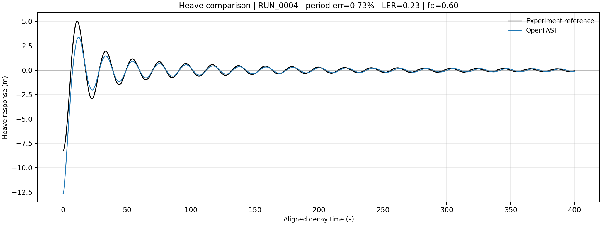
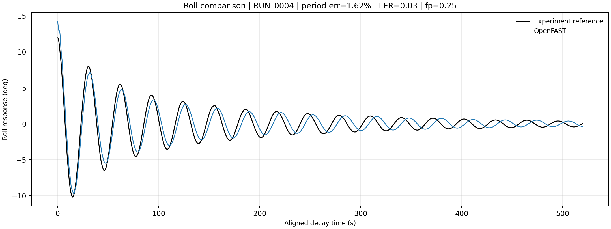
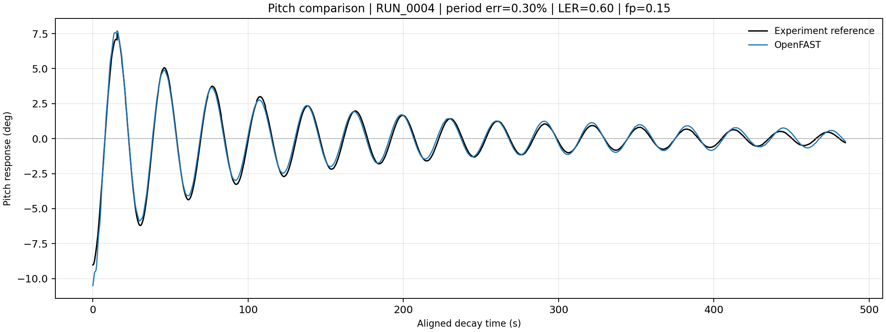
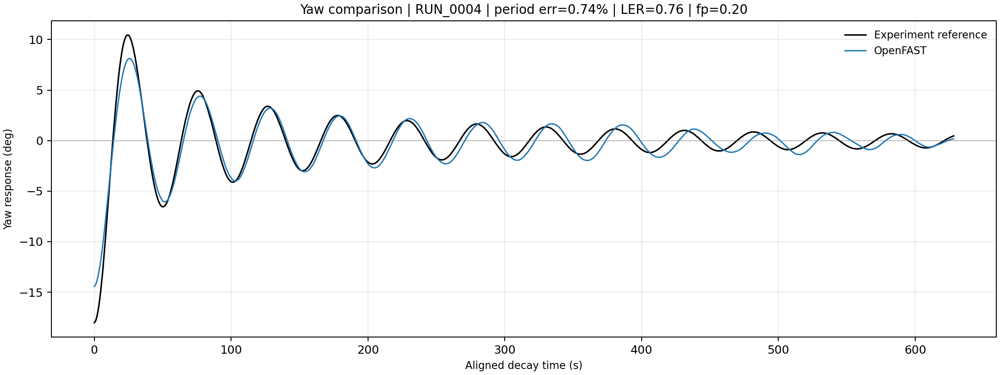

# Six-DOF Comparison: HEAVE095_ROLL090_CMP_0612144710 / RUN_0004

Generated: 2026-07-06

Black = experiment reference. Blue = OpenFAST. Curves use the same aligned decay segment convention as `05_evaluate_metrics.py`.

## Individual DOF Figures

