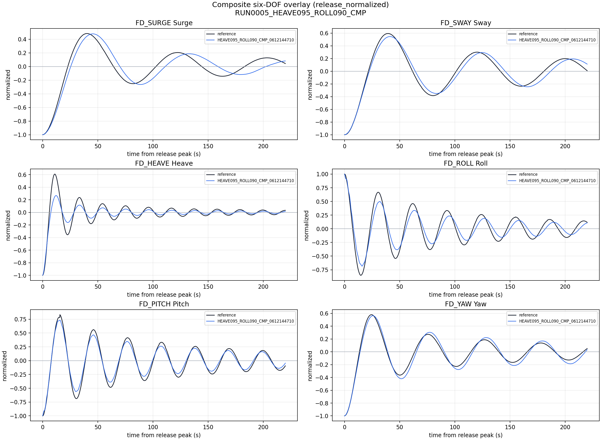
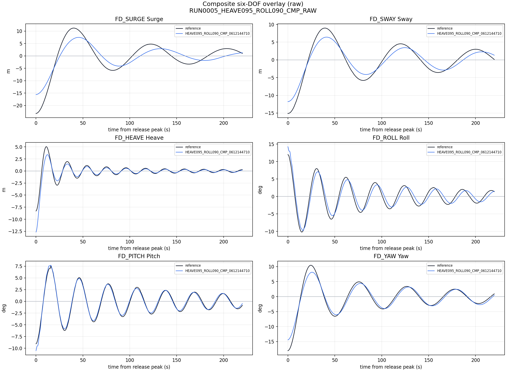

# RUN_0005 Six-DOF Comparison

- candidate: `HEAVE095_ROLL090_CMP_0612144710`
- final_validation_run_id: `RC_FINAL_HEAVE095_ROLL090_CMP_0612144710_20260706T060645Z0000`
- note: generated after observed live final validation; copied into current oracle epoch reports.

## Release-normalized overlay

## Raw overlay

