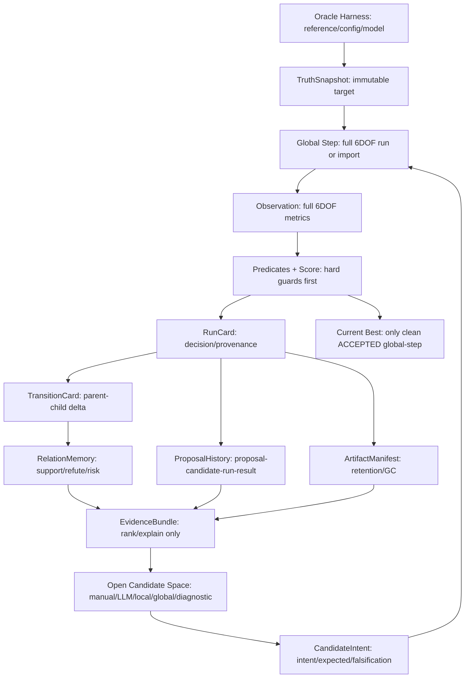

# Memory v3.1 Experiment Comparison

Generated: 2026-07-07T05:17:50+00:00

## Purpose
- Compare the pre-patch v3 memory behavior with the v3.1 evidence-harness patch.
- This experiment is offline-only. No OpenFAST run was executed.

## Final Chain Architecture

## Design Delta
- v3 behavior: memory/history could force legal local proposals into diagnostic-only paths.
- v3.1 behavior: memory/history can lower priority and attach warnings, but cannot veto legal materialization.
- v3.1 adds CandidateIntent and EvidenceBundle while preserving the v3 operational loop.
- Oracle patch: path alias spelling is not treated as truth drift when reference/config/model are semantically unchanged.

## Before / After Summary
| Check | v3 baseline observation | v3.1 current result |
|---|---:|---:|
| Local proposal count | 6 | 6 |
| Materializable local proposals | 3 | 6 |
| Proposal CandidateIntent coverage | 0 / 6 | 6 / 6 |
| ProposalHistory CandidateIntent coverage | not available | 9 / 9 |
| Memory warnings preserved without veto | not available | 3 proposal(s) |
| Query output | matches only | EvidenceBundle + matches |

## Current Top Proposals
- `LP_330171BDD5AE` target=`FD_HEAVE` action=`fp_bquad_probe` ready=`True` status=`similar_outcome_rejected` priority=0.398 intent="FD_HEAVE dominant fp error may improve via fp_bquad_probe" warnings="none"
- `LP_156E5BFB263B` target=`FD_YAW` action=`fp_bquad_probe` ready=`True` status=`similar_outcome_rejected` priority=-0.058 intent="FD_YAW dominant fp error may improve via fp_bquad_probe" warnings="none"
- `LP_71D22C5024DD` target=`FD_SWAY` action=`fp_bquad_probe` ready=`True` status=`similar_outcome_rejected` priority=-0.140 intent="FD_SWAY dominant fp error may improve via fp_bquad_probe" warnings="none"
- `LP_1A727791036F` target=`FD_SURGE` action=`fp_bquad_probe` ready=`True` status=`repeated_rejection_evidence_warning` priority=-0.728 intent="FD_SURGE dominant fp error may improve via fp_bquad_probe" warnings="diagonal_hydro has three recent rejected local probes in this oracle epoch; switch to mechanism search or diagnostic review"
- `LP_D460BA0F215D` target=`FD_ROLL` action=`fp_bquad_probe` ready=`True` status=`repeated_rejection_evidence_warning` priority=-0.846 intent="FD_ROLL dominant fp error may improve via fp_bquad_probe" warnings="diagonal_hydro has three recent rejected local probes in this oracle epoch; switch to mechanism search or diagnostic review"
- `LP_134489D9588E` target=`FD_PITCH` action=`fp_bquad_probe` ready=`True` status=`repeated_rejection_evidence_warning` priority=-1.000 intent="FD_PITCH dominant fp error may improve via fp_bquad_probe" warnings="diagonal_hydro has three recent rejected local probes in this oracle epoch; switch to mechanism search or diagnostic review"

## Verification Commands
- `python -B -m py_compile 03_scripts/20_global_calibration_loop.py 03_scripts/22_workflow_benchmark_selftest.py 03_scripts/global_loop/schema.py 03_scripts/global_loop/local_loop.py 03_scripts/global_loop/memory.py 03_scripts/global_loop/relation_memory.py 03_scripts/global_loop/memory_report.py 03_scripts/global_loop/supervisor.py 03_scripts/global_loop/oracle.py`
- `python 03_scripts/20_global_calibration_loop.py --memory-rebuild`
- `python 03_scripts/20_global_calibration_loop.py --query-memory --target-dof FD_HEAVE --metric fp_error`
- `python 03_scripts/20_global_calibration_loop.py --local-polish --top-k 5`
- `python 03_scripts/20_global_calibration_loop.py --memory-report`
- `python 03_scripts/20_global_calibration_loop.py --memory-gc --dry-run`
- `python 03_scripts/20_global_calibration_loop.py --status`
- `python 03_scripts/22_workflow_benchmark_selftest.py`
